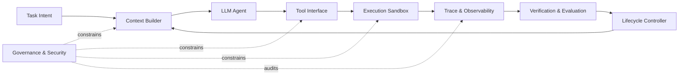
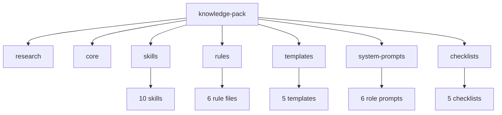

# Harness Engineering Lab

> 一个面向长期 agent 工程的 Harness Engineering 知识库与创新实验场。这里先沉淀方法论、规则、模板和系统提示词，后续会在同一目录中启动 harness 相关创新项目。

<p align="center">
  <a href="./knowledge-pack/README.md"></a>
  <a href="./knowledge-pack/core/innovation-development.md"></a>
  <a href="./knowledge-pack/research/source-registry.md"></a>
</p>

## 这个仓库是什么

这个仓库当前包含一套完整的 **Harness Engineering Knowledge Pack**，用于指导 agent harness 的设计、实现、评估、治理和创新实验。

未来这个仓库会继续扩展为：

| 区域 | 用途 | 状态 |
|---|---|---:|
| [`knowledge-pack/`](./knowledge-pack/README.md) | 长期复用的知识资产、skills、rules、templates、prompts、checklists | Ready |
| [`projects/`](./projects/README.md) | 未来具体 harness 创新项目与实现 | Reserved |
| [`experiments/`](./experiments/README.md) | harness 实验记录、baseline、variant、trace 与评估结果 | Reserved |

## 核心思想

Harness engineering 关注的不是单个 prompt，而是围绕 LLM agent 的完整执行外壳：



核心判断：

- 长程 agent 的可靠性是 `model + harness` 的组合属性。
- 仅优化 prompt 不足以支撑真实工程任务。
- 工具、上下文、沙箱、生命周期、可观测、评估、治理必须一起设计。
- 新 harness 想法必须经过 hypothesis、baseline、trace、evaluation、guardrail 和 rollback。

## ETCLOVG 七层模型

| Layer | 中文说明 | 关键问题 |
|---|---|---|
| `E` Execution | 执行环境与沙箱 | agent 在哪里运行，边界是什么，如何 reset |
| `T` Tooling | 工具接口与协议 | 暴露哪些能力，如何调用，如何审计 |
| `C` Context | 上下文与记忆 | 模型每一步看到什么，如何避免漂移 |
| `L` Lifecycle | 生命周期与编排 | 如何计划、执行、重试、交接、停止 |
| `O` Observability | 可观测与运维 | 如何记录 trace、成本、延迟、失败 |
| `V` Verification | 验证与评估 | 如何判断 outcome、trajectory、evaluator |
| `G` Governance | 治理与安全 | 权限、身份、策略、审计、人类监督 |

## 知识包入口

| 文件 | 说明 |
|---|---|
| [`knowledge-pack/research/source-registry.md`](./knowledge-pack/research/source-registry.md) | 来源、可信度和证据规则 |
| [`knowledge-pack/research/paper-analysis.md`](./knowledge-pack/research/paper-analysis.md) | 本地论文深度解析 |
| [`knowledge-pack/research/external-research.md`](./knowledge-pack/research/external-research.md) | 官方资料、论文、工程实践研究结论 |
| [`knowledge-pack/core/knowledge-system.md`](./knowledge-pack/core/knowledge-system.md) | 核心工程知识体系 |
| [`knowledge-pack/core/innovation-development.md`](./knowledge-pack/core/innovation-development.md) | 创新开发流程、实验门槛和 anti-patterns |

## Agent 可消费 Artifacts



| Artifact | 数量 | 作用 |
|---|---:|---|
| [`skills/`](./knowledge-pack/skills/) | 10 | 给 agent 加载的可执行技能 |
| [`rules/`](./knowledge-pack/rules/) | 6 | 强约束规则 |
| [`templates/`](./knowledge-pack/templates/) | 5 | 计划、评估、调试、拆解、创新实验模板 |
| [`system-prompts/`](./knowledge-pack/system-prompts/) | 6 | Orchestrator、Researcher、Evaluator、Implementer、Reviewer、Innovator |
| [`checklists/`](./knowledge-pack/checklists/) | 5 | 就绪、执行、幻觉、完成、创新准入检查 |

## 推荐使用方式

### 研究或设计 harness

1. 先读 [`source-registry.md`](./knowledge-pack/research/source-registry.md)。
2. 再读 [`knowledge-system.md`](./knowledge-pack/core/knowledge-system.md)。
3. 按任务加载相关 `skills/` 和 `rules/`。
4. 使用 `templates/` 输出计划、评估或调试记录。

### 启动创新项目

1. 在 [`projects/`](./projects/README.md) 下创建项目目录。
2. 在 [`experiments/`](./experiments/README.md) 下记录 baseline、variant、metrics、trace、decision。
3. 使用 [`innovation-experiment-template.md`](./knowledge-pack/templates/innovation-experiment-template.md) 写实验。
4. 用 [`innovation-readiness.md`](./knowledge-pack/checklists/innovation-readiness.md) 做准入检查。

## 未来项目命名建议

```text
projects/
  harness-runtime-sandbox/
  trace-native-evaluator/
  tool-router-mcp/
  context-memory-auditor/
  multi-agent-handoff-protocol/

experiments/
  2026-05-subagent-context-isolation/
  2026-06-tool-routing-ablation/
```

## 贡献原则

- 结论必须有来源、trace、test 或明确假设。
- 新机制必须可回滚。
- 不把 benchmark-only improvement 直接当生产收益。
- 不把未验证 memory 写成事实。
- 不用 prompt 承担应该由 harness 执行的 enforcement。

## 当前状态

- 知识包已完成初版。
- 外部来源已按可信度标注。
- 创新开发轨道已独立建立。
- 未来实现项目可直接从 `projects/` 与 `experiments/` 开始。
